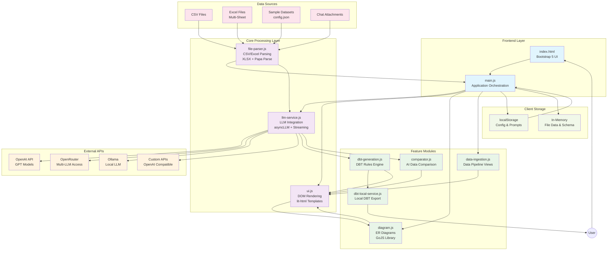
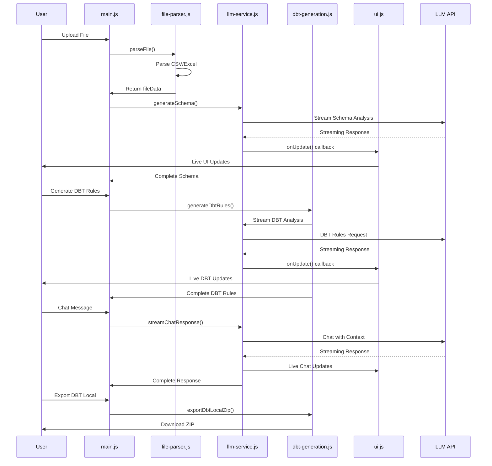

# SchemaForge

A modern web application that automatically generates DBT (Data Build Tool) rules from CSV and Excel files using Large Language Models (LLMs). Upload your data files and get comprehensive schema analysis, column descriptions, and production-ready DBT configurations.

> **🔒 Privacy First**: Your data never leaves your machine. All file processing, schema analysis, and AI interactions happen locally in your browser. Only API requests to your configured LLM provider are sent externally.

## 🚀 Features

### Core Functionality

- **Multi-format Support**: Upload CSV or Excel files with multiple sheet support
- **Intelligent Schema Generation**: Automatic schema inference from file headers and sample data
- **DBT Rules Generation**: Complete DBT models, tests, and configurations
- **Interactive UI**: Clean, responsive interface with tabbed results view
- **Export Capabilities**: Download generated schemas and rules as structured JSON files
- **Entity Relationship Diagrams**: Interactive visualization of database schemas and relationships

### Advanced Features

- **Chat Interface**: Interactive Q&A about your data and schema
- **Real-time Processing**: Live status updates during file processing
- **Privacy-aware Analysis**: Column descriptions include privacy indicators
- **Multiple LLM Providers**: Support for OpenAI, OpenRouter, Ollama, and custom APIs
- **Streaming Responses**: Real-time streaming of LLM outputs as they're generated
- **Interactive ER Diagrams**: Drag-and-drop entity relationship diagrams with GoJS
- **DBT Local Development**: Complete DBT project generation for local development environments
- **AI Data Comparator**: Intelligent comparison of datasets with AI-powered column mapping and mismatch detection
- **Sample Dataset Viewer**: Built-in office viewer for previewing sample datasets directly in browser

## 🏗️ Architecture

### System Overview



### Data Processing Flow



### Component Architecture

The application is built with:

- **Frontend**: Modern ES6 modules with Bootstrap 5 UI
- **File Processing**: Client-side CSV/Excel parsing with XLSX library
- **LLM Integration**: `bootstrap-llm-provider` for flexible API configuration
- **Streaming**: `asyncLLM` for real-time streaming of LLM responses
- **JSON Handling**: `partial-json` for parsing incomplete JSON during streaming
- **Modular Design**: Separated concerns across focused JavaScript modules
- **Visualization**: GoJS library for interactive entity relationship diagrams
- **Privacy-First**: All data processing happens locally in the browser

### File Structure

```
schemaforge/
├── index.html              # Main application interface
├── config.json             # Sample dataset configurations
├── js/
│   ├── main.js             # Application entry point and orchestration
│   ├── file-parser.js      # CSV/Excel file parsing logic
│   ├── llm-service.js      # LLM API integration and prompts
│   ├── ui.js               # DOM manipulation and rendering
│   ├── diagram.js          # Entity relationship diagram functionality
│   ├── dbt-generation.js   # DBT rules generation and chat functionality
│   ├── dbt-local-service.js # DBT local development project creation
│   ├── data-ingestion.js   # Data ingestion utilities and configurations
│   ├── comparator.js       # AI-powered data comparison and mismatch detection
│   └── utils.js            # Shared utility functions
├── prompts/                # LLM prompt templates
│   ├── schema-generation.md
│   ├── dbt-rules-generation.md
│   └── dbt-chat-system.md
├── data/                   # Sample data files
└── README.md               # This file
```

## 🚀 Quick Start

### Prerequisites

- Modern web browser with ES6 module support
- LLM API access (OpenAI, OpenRouter, or compatible provider)

### Setup

1. **Clone the repository**

   ```bash
   git clone <repository-url>
   cd schemaforge
   ```

2. **Open the application**

   ```bash
   # Serve locally (recommended)
   python -m http.server 8000
   # Then open http://localhost:8000

   # Or open directly in browser
   open index.html
   ```

3. **Configure LLM Provider**
   - Click "Configure LLM Provider" in the interface
   - Enter your API key and select a provider
   - Supported providers:
     - OpenAI (`https://api.openai.com/v1`)
     - OpenRouter (`https://openrouter.com/api/v1`)
     - Ollama (`http://localhost:11434/v1`)
     - Any OpenAI-compatible API

## 📋 Usage Guide

### Step 1: Upload Your Data

- Select a CSV or Excel file using the file upload section
- Files with multiple sheets are automatically detected and processed
- Supported formats: `.csv`, `.xlsx`

### Step 2: Schema Generation

- The application automatically extracts headers and sample data
- LLM analyzes the structure and generates comprehensive schema information
- View results in the "Schema Overview" tab
- **Real-time streaming**: Watch as schema information appears incrementally

### Step 3: Column Analysis

- Review detailed column descriptions in the "Column Descriptions" tab
- Privacy indicators help identify sensitive data fields
- Inferred data types and metadata are displayed

### Step 4: Visualize Entity Relationships

- Navigate to the "ER Diagram" tab to see an interactive visualization
- Tables are shown as nodes with their columns listed
- Relationships between tables are displayed as connecting links
- Drag nodes to rearrange the diagram for better visualization
- Use zoom controls to focus on specific parts of the schema
- Primary keys (PK) and foreign keys (FK) are clearly marked

### Step 5: DBT Rules

- Click "Generate DBT Rules" to create DBT configurations
- Watch as rules stream in real-time to the "DBT Rules" tab
- Includes models, tests, and data quality configurations
- Production-ready YAML and SQL code

### Step 6: DBT Local Development

- Click "Export DBT Local" to generate a complete DBT project for local development
- Downloads a ZIP file containing:
  - Complete DBT project structure (`dbt_project.yml`, `profiles.yml`, `packages.yml`)
  - SQL model files with proper seed references
  - Schema configuration with data quality tests (filtered for existing columns)
  - Automated setup script (`setup_dbt.sh`) for one-command deployment
  - Documentation files and README with setup instructions
- **Production-ready**: Includes DuckDB configuration and automated dependency installation
- **Data validation**: Only generates tests for columns that actually exist in your data

### Step 7: Interactive Chat

- Use the chat interface to ask questions about your data
- Request modifications to the generated DBT rules
- Perform exploratory data analysis through natural language
- **Streaming responses**: See the assistant's responses appear in real-time

### Step 8: AI Data Comparator

- Navigate to the "Data Comparator" tab for intelligent dataset comparison
- **Upload Multi-Sheet Excel Files**: Upload Excel files with 2+ sheets for comparison
- **AI Column Mapping**: Automatically maps columns between datasets using AI, even with different column names
- **Smart Data Type Detection**: Identifies dates, numbers, strings with special handling for Excel date serials
- **Mismatch Detection**: AI-powered analysis identifies data discrepancies and inconsistencies
- **Dynamic Summarization**: Create custom summaries with grouping, sum, and count operations
- **Drill-Down Analysis**: Click on mismatched rows for detailed AI-powered explanations

### Step 9: Sample Dataset Viewer

- **Built-in Office Viewer**: Preview sample datasets directly in browser without downloading
- **Multiple Format Support**: 
  - Excel files (.xlsx) → Microsoft Office Web Viewer
  - CSV files → Raw text view in browser
- **One-Click Preview**: Click the "👁️ View" button on any sample dataset card
- **New Tab Opening**: All previews open in new tabs for seamless workflow

### Step 10: Export Results

- Download the complete analysis as a structured JSON file
- Includes schema, column descriptions, and DBT configurations
- Or export the full DBT local development project for immediate use

## 🔧 Technical Implementation

### LLM Integration

The application uses a multi-stage LLM process:

1. **Schema Generation**: Analyzes file structure and sample data to create comprehensive schema
2. **DBT Rules Generation**: Transforms schema into production-ready DBT configurations
3. **DBT Local Project Creation**: Generates complete, deployable DBT projects with automated setup

### DBT Local Development Features

SchemaForge now includes comprehensive DBT local development capabilities:

- **Automated Project Setup**: One-command deployment with `setup_dbt.sh` script
- **Column Validation**: Smart filtering ensures tests are only created for columns that exist in your actual data
- **DuckDB Integration**: Pre-configured for local development with embedded database
- **Package Management**: Automatic installation of `dbt-utils` and other dependencies  
- **Data Conversion**: Automatic Excel/CSV to seed conversion with proper sanitization
- **Documentation**: Complete project documentation with setup instructions
- **Error Prevention**: Eliminates "column not found" errors through validation

### Entity Relationship Diagram

The application uses GoJS to create interactive entity relationship diagrams that dynamically visualize:

- Tables as nodes with expandable column lists
- Relationships between tables as connecting links
- Primary and foreign keys with clear visual indicators
- Automatic layout with force-directed positioning

### AI Data Comparator

The Data Comparator leverages advanced AI capabilities for intelligent dataset analysis:

- **Intelligent Column Mapping**: Uses LLM to map columns across datasets with different naming conventions
- **Excel Date Serial Handling**: Automatically detects and handles Excel date serial numbers (e.g., 45932 → actual dates)
- **Smart Data Type Inference**: AI identifies appropriate data types and aggregation suitability
- **Mismatch Analysis**: Provides detailed explanations for data discrepancies using AI reasoning
- **Dynamic Aggregation**: Supports flexible grouping, sum, and count operations on mapped data
- **Multi-Sheet Processing**: Handles Excel files with multiple sheets using XLSX library

### Sample Dataset Viewer

The application provides seamless dataset preview capabilities:

- **Microsoft Office Web Viewer Integration**: Uses `view.officeapps.live.com` for Excel file viewing
- **CSV Direct Preview**: Opens CSV files directly in browser for immediate viewing
- **Smart Format Detection**: Automatically determines appropriate viewer based on file extension
- **Fallback Handling**: Graceful degradation for unsupported formats

### Streaming Implementation

The application implements real-time streaming of LLM responses to provide immediate feedback during processing. This enables:

- Progressive rendering of schema information as it's generated
- Live updates to the UI during lengthy operations
- Improved user experience with visual feedback

### Supported LLM Providers

The application is designed to work with multiple LLM providers through a flexible configuration system:

- OpenAI API
- OpenRouter
- Ollama (local deployment)
- Any OpenAI-compatible API endpoint

### File Processing

- **CSV**: Native JavaScript parsing with automatic delimiter detection
- **Excel**: XLSX library for multi-sheet support
- **Error Handling**: Graceful fallbacks for malformed files

## 🎯 Use Cases

- **Data Engineers**: Generate DBT boilerplate for new data sources with complete local development setup
- **Analytics Teams**: Quick schema documentation, data quality rules, and immediate DBT project deployment
- **Data Scientists**: Understand data structure before analysis with automated DBT environment setup
- **Consultants**: Rapid data assessment, documentation, and client-ready DBT projects
- **Database Designers**: Visualize and refine database schemas with production-ready implementation
- **DevOps Teams**: Automated DBT project scaffolding with infrastructure-as-code approach
- **Data Quality Analysts**: Use AI Data Comparator to identify discrepancies between datasets and data versions
- **Business Analysts**: Preview and explore sample datasets instantly without software installations
- **Data Migration Teams**: Compare source and target datasets with intelligent column mapping
- **Auditors**: Automated detection and explanation of data mismatches for compliance reporting

## 🛠️ Development

### Code Style

- ES6 modules with modern JavaScript features
- Functional programming approach (no classes)
- Bootstrap 5 for styling (no custom CSS)
- Modular architecture with single responsibility principle

### Linting

```bash
# Format JavaScript and Markdown
npx prettier@3.5 --print-width=120 '**/*.js' '**/*.md'

# Format HTML
npx js-beautify@1 '**/*.html' --type html --replace --indent-size 2
```

## 🔒 Privacy & Security

### Local-First Architecture

SchemaForge is designed with privacy as a core principle:

- **Client-Side Processing**: All file parsing, data analysis, and visualization happens entirely in your browser
- **No Data Upload**: Your CSV/Excel files never leave your machine
- **Local Storage Only**: File contents are stored temporarily in browser memory during processing
- **LLM API Communication**: Only schema metadata and generated prompts are sent to your configured LLM provider
- **No Telemetry**: No usage tracking, analytics, or data collection

### What Gets Sent to LLM APIs

When generating schemas and DBT rules, only the following data is sent to your configured LLM provider:
- File headers and sample data (configurable, typically first 5 rows)
- Generated schema descriptions and table relationships
- Chat messages and context you explicitly provide

### Data Storage

- **Browser Memory**: Temporary storage during active session
- **localStorage**: Only API configurations, custom prompts, and user preferences
- **No Persistence**: File contents are cleared when you close the browser or refresh

## 📝 License

MIT License - see the [LICENSE](LICENSE) file for details.

## 🤝 Contributing

1. Fork the repository
2. Create a feature branch
3. Submit a pull request

## 📞 Support

For issues and questions:

- Check the chat interface for data-related queries
- Review the LLM provider configuration for API issues
- Ensure file formats are supported (CSV, XLSX only)
- For DBT local development issues, verify Python dependencies and file permissions on the setup script

## 🆕 What's New

### AI Data Comparator (Latest Update - v2.0)

- **🤖 Intelligent Column Mapping**: AI automatically maps columns between datasets with different names
- **📊 Smart Data Analysis**: Advanced detection of Excel date serials, data types, and aggregation suitability
- **🔍 Mismatch Detection**: AI-powered identification and explanation of data discrepancies
- **📈 Dynamic Summarization**: Flexible grouping, sum, and count operations with drill-down analysis
- **📋 Multi-Sheet Support**: Process Excel files with multiple sheets for comprehensive comparison

### Sample Dataset Viewer

- **👁️ Built-in Office Viewer**: Preview datasets directly in browser without downloads
- **🔄 Smart Format Handling**: Automatic viewer selection (Office Web Viewer for Excel, direct view for CSV)
- **⚡ One-Click Access**: Instant preview with "View" buttons on sample dataset cards
- **🌐 Cross-Platform**: Works on all modern browsers with no software requirements

### Previous Updates

#### DBT Local Development

- **Complete DBT Project Generation**: Export ready-to-use DBT projects with all necessary configuration files
- **Automated Setup**: One-command deployment with intelligent dependency management
- **Column Validation**: Smart test generation that prevents "column not found" errors
- **DuckDB Integration**: Pre-configured local development environment
- **Production Ready**: Includes proper SQL model generation, schema validation, and documentation
